# Hỏi đáp — Flows

## Flow: Hỏi đáp dựa trên tài liệu

**Trigger**: Người dùng gửi câu hỏi cần tra cứu tài liệu theo chế độ Hybrid RAG.
**Related UC**: TBD
**Related FR**: TBD
**Related E**: —

```mermaid
sequenceDiagram
    actor User as Người dùng
    participant UI as Giao diện
    participant QA as Hệ thống hỏi đáp
    participant PG as PostgreSQL
    participant QD as Qdrant
    participant N4 as Neo4j
    participant LLM as Mô hình ngôn ngữ

    User->>UI: Nhập và gửi câu hỏi
    UI->>QA: Gửi câu hỏi
    QA->>PG: Đọc lịch sử hội thoại
    PG-->>QA: Các lượt hỏi đáp trước
    QA->>PG: Lưu câu hỏi mới
    QA->>QA: Kiểm tra và lập kế hoạch tra cứu

    par Tìm theo nội dung
        QA->>QD: Tìm bằng vector và từ khóa BM25
        QD-->>QA: Danh sách ID đoạn tài liệu và thứ hạng
    and Tìm theo đồ thị tri thức
        QA->>N4: Tra cứu thực thể và quan hệ liên quan
        N4-->>QA: Ngữ cảnh đồ thị và ID tài liệu nguồn
    end

    QA->>QA: Gộp thứ hạng bằng RRF, loại trùng
    opt Có ID tài liệu
        QA->>PG: Lấy nội dung và metadata theo ID
        PG-->>QA: Các đoạn tài liệu gốc
        QA->>QA: Xếp hạng lại, giữ tài liệu nguồn của đồ thị
    end

    alt Có tài liệu để trả lời
        QA->>LLM: Câu hỏi, tài liệu và ngữ cảnh đồ thị
        LLM-->>QA: Nội dung trả lời và ID nguồn sử dụng
        QA->>QA: Kiểm tra trích dẫn, xử lý nguồn không hợp lệ
    else Không có tài liệu để trả lời
        QA->>QA: Tạo phản hồi chưa đủ thông tin
    end

    QA-->>UI: Truyền câu trả lời và nguồn nếu có
    QA->>PG: Lưu câu trả lời và trích dẫn
    UI-->>User: Hiển thị câu trả lời
```

Hệ thống hỏi đáp gộp Backend và Agent Service. Qdrant lưu chỉ mục tìm kiếm vector và BM25; Neo4j lưu thực thể, quan hệ và tham chiếu nguồn; PostgreSQL lưu nội dung tài liệu gốc cùng lịch sử hội thoại.

Sơ đồ rút gọn các lượt gọi LLM khi lập kế hoạch và các bước tra cứu lặp lại. Hai truy vấn vector và BM25 trong Qdrant được gộp thành một cặp thông điệp; thực tế chúng chạy song song với truy vấn Neo4j. Bước xếp hạng lại phụ thuộc cấu hình. Nếu trích dẫn không hợp lệ, hệ thống thử soạn lại trong giới hạn cho phép rồi trả phản hồi chưa đủ thông tin nếu vẫn không có nguồn hợp lệ.

Nội dung được truyền từng đoạn trong lúc sinh; sơ đồ gộp việc truyền nội dung và trả nguồn thành một thông điệp. Backend lưu câu trả lời trước khi gửi sự kiện hoàn tất. Các luồng hỏi lại, chào hỏi, chặn câu hỏi và lỗi kết nối nằm ngoài phạm vi sơ đồ này.
